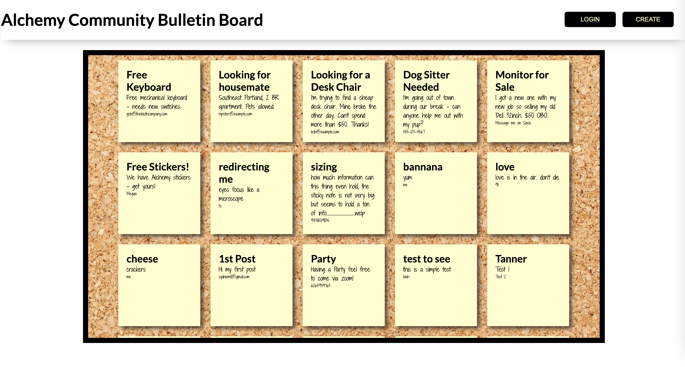

[CSS Notes](https://gist.github.com/dpcairns/8375a5c76511f831ab6b3a53bc7967e9)

## [01 - Hide and Seek](https://github.com/alchemycodelab/half-baked-web-01-hide-seek)

## [02 - Character Designer](https://github.com/alchemycodelab/half-baked-js-character-designer)

## [03 - Mushroom Festival](https://github.com/alchemycodelab/half-baked-js-mushroom-festival)

## [04 - Supabase Countries Search](https://github.com/alchemycodelab/half-baked-web-01-countries-search)

## [05 - Supabase Dog Adoption List/Detail Page](https://github.com/alchemycodelab/half-baked-web-01-adopt-a-dog)

## [06 - Supabase Bulletin Board](https://github.com/alchemycodelab/web-01-bulletin-board-RUBRIC)

## [07 - Supabase Todo App](https://github.com/alchemycodelab/half-baked-js-todo-supabase)

## [08 - Supabase Fuzzy Bunny Organizer](https://github.com/alchemycodelab/half-baked-js-fuzzy-bunny-organizer)

## [09 - Supabase Realtime Messenger App](https://github.com/alchemycodelab/half-baked-web-01-messenger-app/)

## [10 - Supabase Yawp Restaruant Reviewer](https://github.com/alchemycodelab/yawp-vanilla-js)

