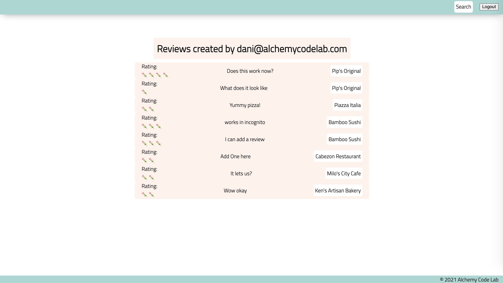

# Deliverable 10 - Supabase Yelp-alike

### Live Example:
https://upgraded-winner-147551f5.pages.github.io/ 

| User should be able to . . .                                                         |             |
| :----------------------------------------------------------------------------------- | ----------: |
| Visit the deployed pages on GitHub pages, with link in the About section of the Github repo |    1 |

| Events                                                                                |             |
| :----------------------------------------------------------------------------------- | ----------: |
| On the home page (`'/'`), Login and Signup using the login and signup form. On success, redirect to the `/families` page   |        1 |
| Logout by clicking the logout button                                                       |        1 |
| If a non-logged-in user tries to visit the `/profile` or `/search` or `/restaurants` page, redirect them to the login page     |       1 |
| `/restaurants/?id=2` on load should fetch and render the restaurant details, including its reviews (with review, stars, and author)     |       1 |
| `/restaurants/?id=2` should allow the user to add a new review. On adding a new review, clear out the restaruant detail, refetch, and re-render with the updated data    |       1 |
|  `/restaurants/?id=2` on each review, user should be able to click the author name to go to its detail page    |       1 |
| `/search` should allow the user to search restaruants by name (text input) and cuisine (dropdown) in superbase and render them to the DOM on search    |       1 |
| `/search` should allow the user to search restaruants in superbase and render them to the DOM on search    |       1 |
| `/profile/?id=3` on load should fetch all reviews for this user and render them to the DOM (with review, stars, restaurant name, and author)   |       1 |
| `/profile/?id=3` on each review, user should be able to click the restaurant name to go to its detail page    |       1 |

| Functions                                                                                |             |
| :----------------------------------------------------------------------------------- | ----------: |
| AUTH: `getUser()` : return currently logged in user |1|
| ASYNC AUTH: `signupUser()` : create a new user in superbase and return user |1|
| ASYNC AUTH: `signinUser()` : log into superbase and return currently logged in user |1|
| PURE: `renderRestaurantCard(restaruant)` : returns a DOM node |1|
| PURE: `renderReview(review)` : returns a DOM node |1|
| PURE: `renderRestaruantDetail(restaurant)` : returns a DOM node (including reviews) |1|
| ASYNC: `searchRestautants(query, cuisine)` :  returns matching restaurants |1|
| ASYNC: `getRestaurantById(id)` :  returns restaurant and its reviews |1|
| ASYNC: `createReview(restaurant)` : create review for this restaurant in supabase for this user |1|
| ASYNC: `getReviewsByUserId(id)` : get this user's reviews |1|