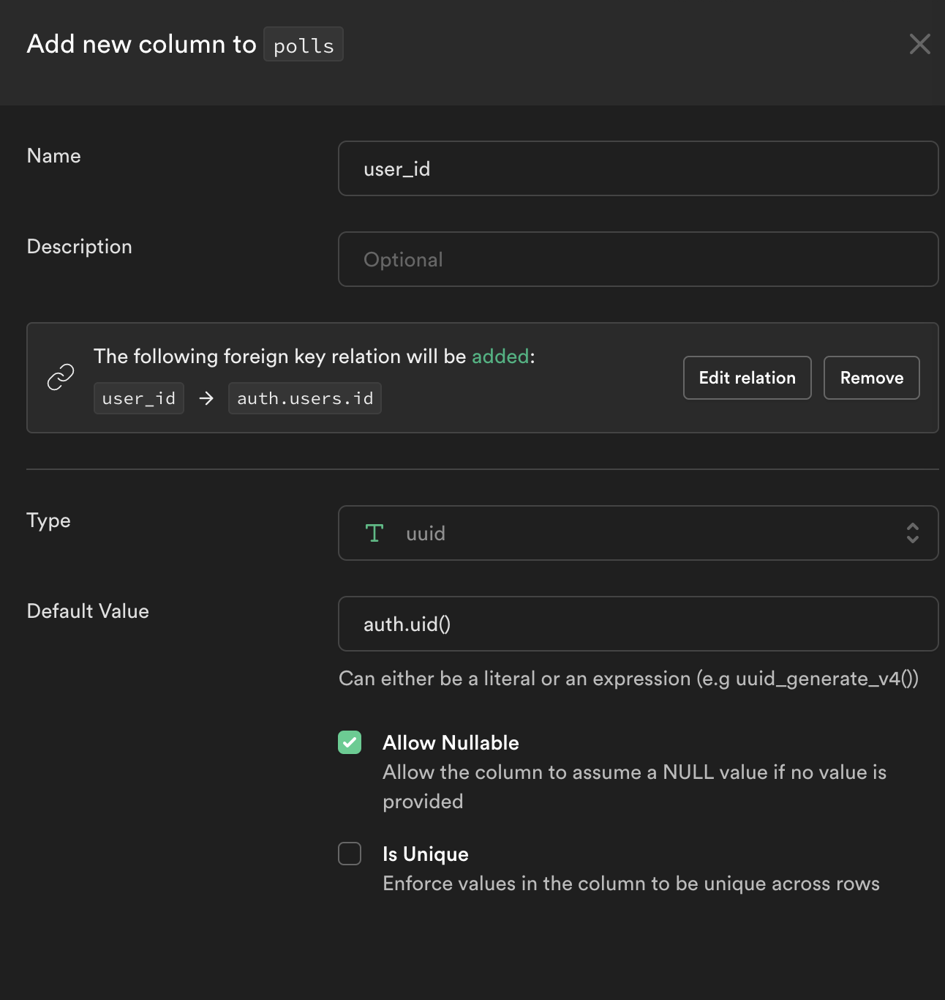
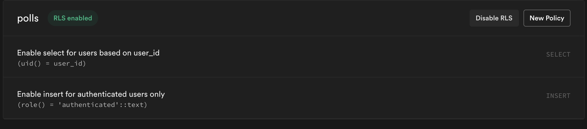

# Lecture 6 - User Auth and Creating Items in Supabase

## Supabase template with auth

In addition to a functioning Sign In/Sign Up form, we include some basic, boilerplate auth functions in the template.

Lets talk about what each one does.


```js
// when a user tries to visit a page that calls this function, we automatically redirect the user back to the login page if they are not logged in
export async function checkAuth() {
    const user = await getUser();

    if (!user) location.replace('../'); 
}

// when a user tries to visit a page that calls this function, we automatically redirect the user away from the login page if they are already logged in
export async function redirectIfLoggedIn() {
    if (await getUser()) {
        location.replace('./some-other-page');
    }
}

// signs an new user in and puts an auth token in local storage in the browser
export async function signupUser(email, password){
    const response = await client.auth.signUp({ email, password });
    
    return response.user;
}

// signs an existing user in and puts an auth token in local storage in the browser
export async function signInUser(email, password){
    const response = await client.auth.signIn({ email, password });

    return response.user;
}

// removes the token from local storage and redirects the user home
export async function logout() {
    await client.auth.signOut();

    return window.location.href = '../';
}

// alerts the user if there is an error with their supabase call
function checkError({ data, error }) {
    return error ? console.error(error) : data;
}

```

## Row Level Security

Imagine a todo app. When you log in, you only see your todos, and nobody elses. RLS is the tool that lets you do this in supabase.

RLS lets us, among other things:
1) allow all users to read all rows, but only 'logged in' users can create, update, or delete rows
1) add a user_id automatically to each row on its creation
1) restrict read access so that only the creator of a row (matching user_id) can read it. This way, users cannot step on each others' toes or read each others' messages, etc.





## Async/Await Creating items in supabase

[Supabase Select Docs](https://supabase.com/docs/reference/javascript/insert)

```js

const newDog = await client
    .from('dogs')
    .insert({ 
        name: 'spot', 
        user_id: client.auth.user().id, 
    })
    .single();

```
