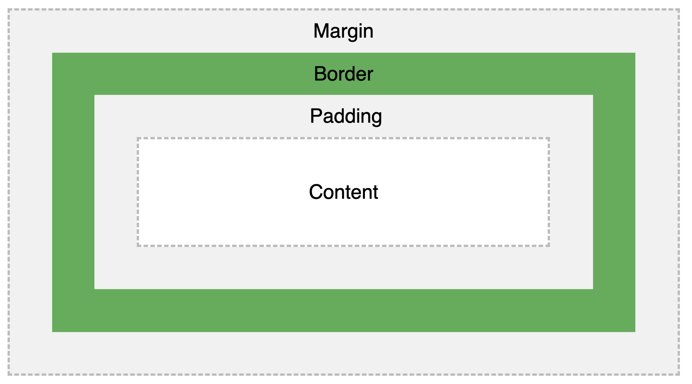
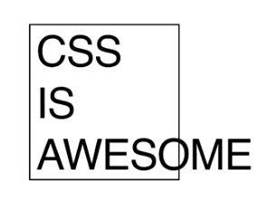
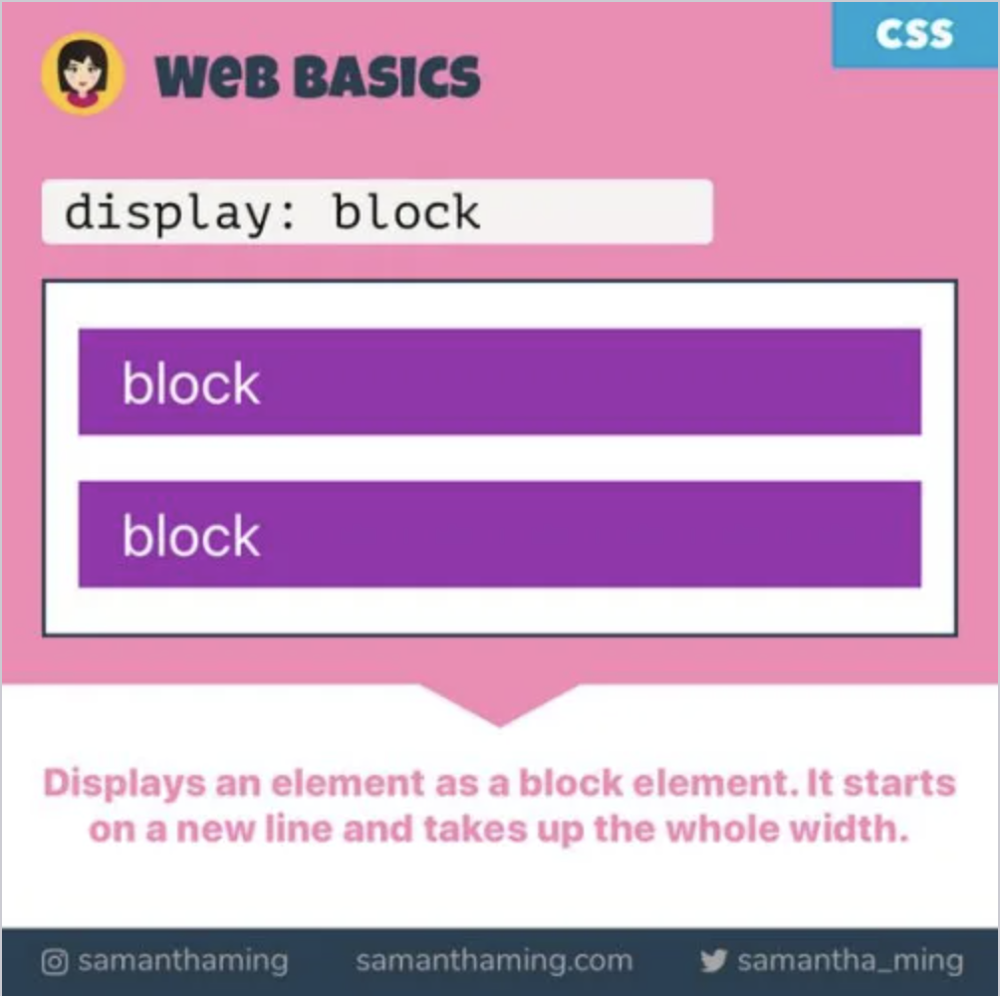
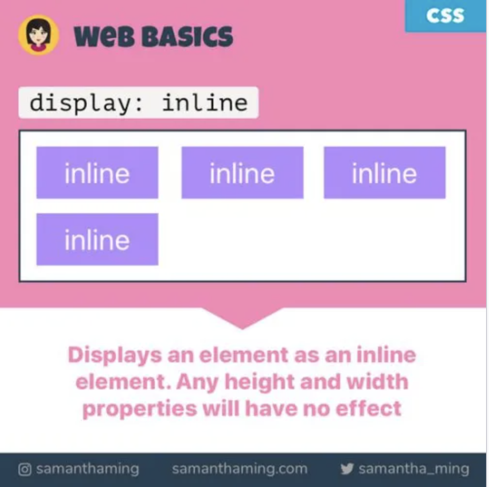

CSS
===

> Styling Content

## Cheat Sheet Resource

https://htmlcheatsheet.com/css/

## Dev Tools

* Visual match from dev tools to live browser on hover
* select from `Elements`
* Change values
    * `⬆⬇` +-1
    * `SHIFT` + `⬆⬇` +-10
    * `OPTION/ALT` + `⬆⬇` +-.1
* Color picker

## Selector + Props

### Selector

* tag name
    - div, a, p
* class 
    - comes from <div class="container"> in html
    - .container, .box
* id 
    - comes from <div id="select-button"> in html
    - #select-button

### Props

1. Layout
1. Stylistic

## Padding, Border, Margin

- padding: the big fluffy winter coat
- margin: social distancing
- border: the, uh, border



### Box model shorthand:

Padding and margin properties let us mush together everything on one line if we want

```css
.my-div {
    margin-top: 10px;
    margin-right: 5px;
    margin-bottom: 10px;
    margin-left: 5px;
    padding-top: 10px;
    padding-right: 5px;
    padding-bottom: 10px;
    padding-left: 5px;
}
```

can become

```css
.my-div {
    /* clockwise from the top, top right bottom left (like TROUBLE: TRBL) */
    margin: 10px 5px 10px 5px;
    padding: 10px 5px 10px 5px;
}
```

## Colors

`color` vs `background`
 - `color: pink` 
    - makes: the _font- pink
 - `background: pink` 
    - makes the _background color_ pink
    - `background: url("paper.gif");` also works
    -   note: `background-size`, `background-repeat`, and `background-attachment` can be important. You'll need to research and fiddle with the options to get what you want _juuuust right_

## Background shorthand

Background properties let us mush together everything on one line. But it's annoying because you have to remember the right order.

```css
body {
  background-color: #ffffff;
  background-image: url("img_tree.png");
  background-repeat: no-repeat;
  background-position: right top;
  background-size: cover;
}
```

can be (annoyingly) shortened to 

```css
body {
  background: cover #ffffff url("img_tree.png") no-repeat right top;
}
```

## Font

- set defaults in the root, override them in the children:  
    - `2rem` will make the font size _twice_ the root
    - `0.75rem` will make the font size _75%_ of the root

```css
body {
  font: 20px Arial, sans-serif;
}

ul {
  font-size: .5rem;
}
```

## Sensible defaults

### These will save some headaches in the future:

```css
body, html {
    width: 100%;
    height: 100%;
    padding: 0;
    margin: 0;
}

* {
    box-sizing: border-box;
}
```

# Layout: 
## okay here's where it gets weird


### The old world
- tables: https://www.spacejam.com/
- `float: left` 
    - simulates a sort of gravity on a page
    - elements 'fall' either to the left or right

# Display block, inline and inline-block






# Flex and Grid
## Layout easy mode

[Flexbox Docs](https://css-tricks.com/snippets/css/a-guide-to-flexbox/)
- Games for learning:
    - http://www.flexboxdefense.com/
    - https://flexboxfroggy.com/

[Grid Docs](https://css-tricks.com/snippets/css/complete-guide-grid/)
- Games for learning:
    - https://cssgridgarden.com/

## Centering

Old and usually perfectly fine way, but sometimes just doesn't work for complicated reasons:

```css
.child-container {
    margin: 0 auto;
}
```

Flexbox:
```css
.parent-container {
    /* flexbox talks DOWN to its child elements */
    display: flex;
    justify-content: center;
    align-items: center;
    flex-direction: column;
}
```

## Interaction and animaion

Use `:hover` or `:active` pseudoclasses with the `transition` property to trigger a hover animation.

```css
.my-cool-div {
    transition: all .2s ease-in-out;
}

.my-cool-div:hover {
    transform: scale(2) rotate(45deg)
}

.my-cool-div:active {
    transform: scale(1.5) rotate(10deg)
}
```

`transform`
- Breaks items out of CSS layout
- The big three: translate, scale, rotate
